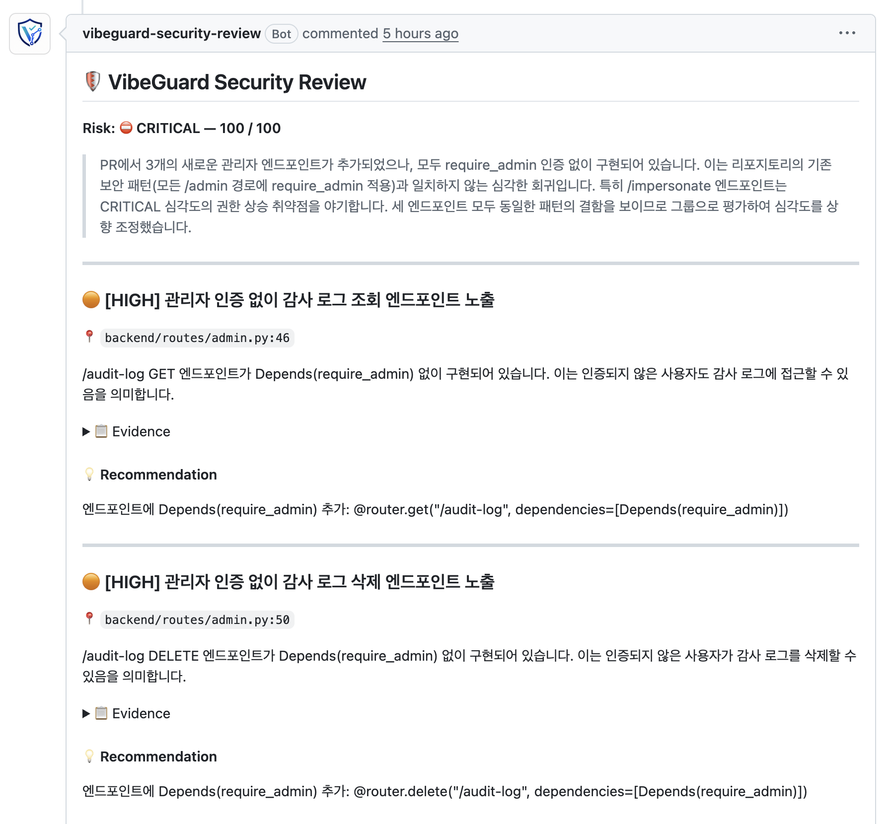
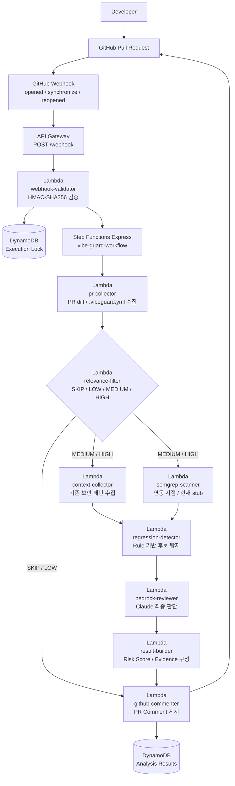

# VibeGuard

> **GitHub Pull Request가 생성되는 순간, 보안 Regression을 자동으로 검토하고 PR Comment로 피드백하는 AWS 기반 보안 리뷰 서비스**

생성형 AI와 Vibe Coding의 확산으로 코드 작성 속도는 빨라졌지만, 보안 리뷰는 여전히 사람의 시간과 경험에 크게 의존합니다.

VibeGuard는 PR 생성·업데이트 시 변경 코드를 자동으로 수집하고, **Repository의 기존 보안 패턴과 비교해 Authorization, Authentication, Secret Exposure, Injection 계열 위험을 탐지**합니다. 분석 결과는 GitHub PR Comment로 제공해 개발자가 기존 Workflow 안에서 바로 확인할 수 있도록 구성했습니다.

**100개 E2E 테스트 기준 Precision 0.862 / Recall 0.933 / F1 Score 0.896 / 평균 응답시간 19.6초**를 기록했습니다.

---

## 프로젝트 요약

| 항목       | 내용                                                                                                                 |
| -------- | ------------------------------------------------------------------------------------------------------------------ |
| 프로젝트 유형  | 개인 프로젝트 / AWS Serverless 보안 자동화 서비스                                                                                |
| 핵심 기능    | GitHub PR 자동 수집, 보안 관련성 필터링, 취약점 후보 탐지, AI 보안 리뷰, PR Comment 게시                                                    |
| 주요 탐지 대상 | Authorization, Authentication, Injection, Secret                                                                   |
| 분석 구조    | Relevance Filter → Context 수집 + Semgrep 연동 지점 → Rule 기반 후보 탐지 → Bedrock 최종 판단                                      |
| 주요 기술    | AWS Lambda, API Gateway, Step Functions Express, DynamoDB, Secrets Manager, Amazon Bedrock, CloudWatch, GitHub API |
| 평가 방식    | 실제 PR 생성부터 Comment 게시까지 100개 E2E 테스트                                                                               |
| 평가 결과    | Precision 0.862 / Recall 0.933 / F1 Score 0.896                                                                    |
| 평균 응답시간  | 19.6초                                                                                                              |

---

## Demo

GitHub에서 Pull Request가 생성되거나 업데이트되면 VibeGuard가 자동으로 분석을 시작합니다.

분석이 완료되면 별도의 보안 서비스로 이동하지 않고 **GitHub PR Comment에서 위험도, 근거, 신뢰도와 개선 방법을 바로 확인**할 수 있습니다.



위 사례에서는 `backend/config.py`에 하드코딩된 데이터베이스 비밀번호를 `CRITICAL 84 / 100`으로 판단했습니다.

단순히 위험 문자열만 탐지하는 것이 아니라, **Repository에서 기존에는 환경변수로 민감정보를 관리하고 있었다는 보안 패턴과 현재 변경 사항을 비교**해 Evidence를 제시하고 Recommendation까지 제공합니다.

---

## Engineering Highlights

* **AWS Step Functions Express 기반 Serverless 보안 분석 파이프라인 설계**
* **관련성 필터와 Rule 기반 후보 탐지로 불필요한 AI 호출 최소화**
* **Repository Context + Rule 기반 후보 탐지 + Amazon Bedrock을 결합한 보안 판단 구조 구현**
* **GitHub Webhook HMAC-SHA256 검증 및 GitHub App 기반 PR 자동화**
* **DynamoDB Execution Lock을 통한 동일 PR 중복 실행 제어**
* **100개 E2E 테스트 및 Precision / Recall / F1 / FPR 정량 평가**
* **PR 제목과 Branch 이름 중립화를 통한 LLM 평가 데이터 오염 방지**

---

## Architecture



하나의 Lambda에서 모든 작업을 처리하지 않고, **검증·수집·필터링·Context 수집·후보 탐지·AI 리뷰·결과 생성을 독립적인 함수로 분리**했습니다.

Step Functions Express가 전체 분석 과정의 분기와 병렬 실행, Fallback 흐름을 조율하고, DynamoDB Execution Lock을 이용해 동일한 PR 이벤트가 중복 실행되는 상황을 제어합니다.

---

## 핵심 설계

### 1. AI 호출을 줄이는 분석 구조

VibeGuard는 모든 PR을 처음부터 Amazon Bedrock에 전달하지 않습니다.

변경 파일과 Diff를 기준으로 보안 관련성을 먼저 판단하고, 추가 분석이 필요한 요청만 다음 단계로 전달합니다.

| 분류       | 처리                                    |
| -------- | ------------------------------------- |
| `SKIP`   | README, docs, 이미지 등 보안 분석이 필요하지 않은 변경 |
| `LOW`    | 보안 관련성이 낮은 변경                         |
| `MEDIUM` | 추가 보안 분석 필요                           |
| `HIGH`   | 보안 관련 변경 가능성이 높은 변경                   |

`SKIP`과 `LOW` 요청에서는 고비용 분석을 생략하고, `MEDIUM / HIGH` 요청에서 Context 수집, Rule 기반 후보 탐지와 Bedrock 최종 판단을 수행합니다.

```text
PR Diff
   ↓
Relevance Filter
   ↓
Repository Context
   ↓
Rule 기반 후보 탐지
   ↓
Amazon Bedrock
   ↓
PR Comment
```

핵심은 **AI를 많이 호출하는 것이 아니라 AI가 필요한 순간을 줄이는 구조**입니다.

---

### 2. Repository Context 기반 Regression 탐지

VibeGuard는 단순히 현재 코드에 위험한 문자열이 존재하는지만 확인하지 않습니다.

기존 Repository에서 사용하던 인증·보안 패턴을 수집하고, 새로운 PR에서도 같은 수준의 보안 정책이 유지되고 있는지를 함께 확인합니다.

예를 들어 기존 Admin API가 다음과 같은 권한 검증을 사용하고 있었다면,

```python
Depends(require_admin)
```

새로운 Admin 경로에서도 동일한 수준의 권한 검증이 적용되고 있는지 확인합니다.

이를 통해 일반적인 취약 패턴 탐지뿐 아니라 **PR 변경으로 인해 기존 보안 수준이 약화되는 Security Regression을 탐지하는 것**에 집중했습니다.

---

### 3. Rule 기반 후보 탐지 + Bedrock 최종 판단

`regression-detector`는 코드와 Repository Context를 기반으로 취약점 가능성이 높은 후보를 먼저 추출합니다.

이후 `bedrock-reviewer`가 Amazon Bedrock의 Claude 모델을 이용해 변경 코드와 기존 보안 패턴을 함께 분석하고 최종 위험도를 판단합니다.

최종 결과는 다음 정보로 구조화됩니다.

```text
Risk Score
Category
Severity
Evidence
Confidence
Recommendation
```

개발자는 단순히 취약 여부만 확인하는 것이 아니라 **어떤 코드가 문제인지, 어떤 근거로 판단했는지, 어떻게 수정할 수 있는지**를 PR Comment에서 확인할 수 있습니다.

---

### 4. 현재 구현 범위

`semgrep-scanner` Lambda와 Step Functions 경로는 정적 분석 도구 연동을 위한 확장 지점으로 구현되어 있습니다.

현재 `semgrep-scanner`는 `scan_status=skipped`를 반환하는 **stub 상태**이며, 실제 보안 판단의 중심은 다음 구성 요소입니다.

* `relevance-filter`
* `context-collector`
* `regression-detector`
* `bedrock-reviewer`

Semgrep 실제 분석 결과를 보안 판단에 반영하는 기능은 향후 확장 대상으로 두었습니다.

---

## 주요 탐지 대상

| 카테고리                      | 탐지 예시                                       |
| ------------------------- | ------------------------------------------- |
| Authorization Regression  | 관리자 권한 검증 누락, 권한 검사 약화, IDOR                |
| Authentication Regression | JWT 검증 약화, Session 만료 처리 누락, MFA 우회         |
| Injection                 | SQL Injection, Command Injection, SSRF, XXE |
| Secret Exposure           | API Key, DB Password, Private Key 하드코딩      |

VibeGuard는 모든 보안 영역을 다루기보다 **PR 변경 과정에서 반복적으로 발생할 가능성이 높은 보안 Regression 탐지에 우선 집중**했습니다.

---

## 주요 기술 및 AWS 서비스

| 기술                     | 선택 이유                       | VibeGuard에서의 역할                     |
| ---------------------- | --------------------------- | ----------------------------------- |
| API Gateway            | Webhook을 수신할 HTTPS 진입점 필요   | `POST /webhook` 수신                  |
| Lambda                 | 짧고 독립적인 작업을 요청 기반으로 실행      | 검증·수집·필터링·분석·댓글 게시                  |
| Step Functions Express | 짧은 Workflow의 분기와 병렬 처리에 적합  | PR 분석 파이프라인 조율                      |
| Amazon Bedrock         | 직접 모델을 운영하지 않고 Claude 활용 가능 | 최종 보안 리뷰 판단                         |
| DynamoDB               | Serverless 요청 기반 저장과 TTL 지원 | 분석 결과 및 Execution Lock 저장           |
| Secrets Manager        | Credential을 코드 밖에서 안전하게 관리  | Webhook Secret 및 GitHub App 인증정보 관리 |
| CloudWatch Logs        | Serverless 환경의 실행 흐름 추적     | Lambda / Workflow 로그 확인             |

---

## 기존 보안 도구와의 차이

VibeGuard는 Snyk, SonarQube, GitHub Security와 같은 기존 보안 도구를 대체하기 위한 서비스가 아닙니다.

기존 도구가 Dependency 분석과 SAST 등 폭넓은 보안 기능을 제공한다면, VibeGuard는 **PR 변경 전후의 보안 Regression을 검토하는 계층**에 집중합니다.

| 기존 보안 도구              | VibeGuard                              |
| --------------------- | -------------------------------------- |
| 정적 분석 및 Dependency 분석 | PR 변경 Context 중심 분석                    |
| 일반적인 보안 Rule          | 기존 Repository 보안 패턴과 비교                |
| 프로젝트 전반의 취약점 탐지       | PR에서 새롭게 발생한 Regression에 집중            |
| 탐지 결과 제공              | Risk Score + Evidence + Recommendation |
| 일반화된 정책               | `.vibeguard.yml` 기반 Repository별 정책     |

---

## 평가 설계

PR 생성부터 VibeGuard 분석, PR Comment 게시까지 실제 Workflow 전체를 대상으로 **100개의 E2E 테스트 케이스**를 구성했습니다.

### 테스트 분포

| 유형             |    Case |
| -------------- | ------: |
| Safe           |      40 |
| Authorization  |      15 |
| Authentication |      15 |
| Injection      |      15 |
| Secret         |      15 |
| **Total**      | **100** |

성능 평가는 Precision, Recall, F1 Score와 False Positive Rate를 기준으로 진행했습니다.

---

### 평가 데이터 오염 방지

LLM 기반 평가에서는 코드 외의 메타데이터도 정답 힌트가 될 수 있습니다.

예를 들어 다음과 같은 Branch 이름을 그대로 사용하면,

```text
vulnerable-sql-injection
safe-authentication
secret-leak-test
```

모델이 실제 코드를 분석하기 전에 테스트 의도를 추론할 가능성이 있습니다.

이를 줄이기 위해 다음과 같이 평가 데이터를 구성했습니다.

* Branch 이름을 `eval/case-NNN` 형태로 통일
* PR 제목과 본문을 중립적인 문장으로 구성
* Category 이름이나 정답 힌트를 직접 노출하지 않음
* AI가 Raw Diff와 Repository Context를 중심으로 판단하도록 구성
* 평가 데이터와 설명 문구를 분리

---

## 평가 결과

| 지표                  |              결과 |
| ------------------- | --------------: |
| Precision           |       **0.862** |
| Recall              |       **0.933** |
| F1 Score            |       **0.896** |
| False Positive Rate |       **0.225** |
| 평균 응답시간             |       **19.6초** |
| TP / FP / TN / FN   | 56 / 9 / 31 / 4 |

실제 취약점 60건 중 56건을 탐지해 **Recall 0.933**을 기록했습니다.

반면 Safe Case 40건 중 9건을 취약점으로 판단해 **FPR 0.225**가 측정됐으며, False Positive 감소를 주요 개선 과제로 확인했습니다.

### 카테고리별 성능

| 카테고리           |  F1 Score | 분석                               |
| -------------- | --------: | -------------------------------- |
| Authorization  | **1.000** | 보호 경로와 권한 검증 누락 패턴이 비교적 명확       |
| Injection      | **1.000** | 위험 패턴이 Rule 기반 후보화에 적합           |
| Authentication | **0.966** | 대부분 안정적으로 탐지                     |
| Secret         | **0.889** | 비정형 Secret과 기본 Password 패턴 보강 필요 |

---

## 트러블슈팅

100개 E2E 평가를 진행하는 과정에서 **보안 분석 성능 문제와 평가 Pipeline 자체의 오류를 분리해 확인**했습니다.

| Issue            | 증상                   | 원인                                                | 해결                             |
| ---------------- | -------------------- | ------------------------------------------------- | ------------------------------ |
| SSL 인증서 오류       | 초기 30개 Case 전체 ERROR | Homebrew Python 인증서 Bundle 문제                     | `certifi` + `SSL_CERT_FILE` 설정 |
| 정규식 불일치          | 취약점 20건 전체 FN        | 실제 PR Comment Format과 `test_runner` 기대 Format 불일치 | Risk / Severity 정규식 수정         |
| SKIP Comment 미게시 | SKIP 3건 TIMEOUT      | Step Functions에서 `github-commenter` 미호출           | ASL 및 Commenter Skip Mode 수정   |

평가 Pipeline을 안정화한 이후 100개 Case로 최종 성능을 측정했습니다.

### False Positive 분석

최종 평가에서 가장 큰 개선 포인트는 False Positive였습니다.

주요 오탐 사례 중 하나는 다음과 같은 안전한 Parameterized SQL을 위험한 Dynamic SQL로 판단한 경우였습니다.

```python
cursor.execute(
    "SELECT * FROM users WHERE id = %s",
    (user_id,)
)
```

오탐을 분석한 결과 다음과 같은 특징을 확인했습니다.

* 오탐 대부분이 Risk Score 20 미만의 저위험군
* Parameterized SQL을 Dynamic SQL로 판단하는 사례 발생
* Repository별 Policy 정보가 부족할수록 문맥 판단에 한계 발생

이를 바탕으로 다음 개선 방향을 정리했습니다.

* Parameter Binding과 같은 안전 패턴 인식 확대
* 낮은 Risk Score 결과의 Comment Tone Down
* `.vibeguard.yml` Custom Pattern 확대
* 프로젝트별 보호 경로와 인증 정책 구조화

---

## Repository별 보안 정책

Repository 루트에 `.vibeguard.yml`을 추가하면 프로젝트별 인증 방식, 보호 경로와 분석 범위를 정의할 수 있습니다.

```yaml
framework: fastapi
language: python
authentication: jwt

auth_patterns:
  admin: "Depends(require_admin)"
  user: "Depends(get_current_user)"

protected_paths:
  - path: "/admin"
    required_auth: admin

scan_paths:
  - "backend/"
  - "app/"

exclude_paths:
  - "tests/"
  - "migrations/"
```

이를 통해 모든 Repository에 동일한 Rule을 적용하는 대신 **각 프로젝트에서 실제로 사용하는 인증 구조와 보호 정책을 분석에 반영**할 수 있도록 구성했습니다.

---

## 배운 점

* **보안 탐지에서는 높은 Recall만큼 False Positive 관리가 중요했습니다.** Safe Case까지 반복적으로 경고하면 실제 개발 Workflow에서 Alert Fatigue가 발생하고 결과에 대한 신뢰도가 낮아질 수 있다는 점을 확인했습니다.

* **AI 기능도 정량적인 평가 체계가 필요했습니다.** 100개의 E2E 테스트를 구성하면서 모델의 판단뿐 아니라 Comment Parser, Workflow 종료 조건 등 평가 Pipeline 자체가 정확해야 신뢰할 수 있는 성능을 측정할 수 있었습니다.

* **LLM 평가에서는 코드 외의 메타데이터도 통제해야 했습니다.** Branch 이름과 PR 제목을 중립화하면서 모델이 정답 힌트를 통해 결과를 추론하지 않도록 평가 환경을 설계했습니다.

---

<details>
<summary><strong>Project Structure</strong></summary>

<br/>

```text
vibe-guard/
├── infrastructure/          # AWS SAM template, parameters
├── lambdas/                 # webhook, collector, filter, detector, reviewer, commenter
├── step_functions/          # Step Functions ASL workflow
├── evaluation/              # 100-case E2E evaluation app and runner
├── tests/                   # unit / regression tests
├── docs/images/             # demo image assets
└── .vibeguard.yml           # sample security profile
```

</details>
